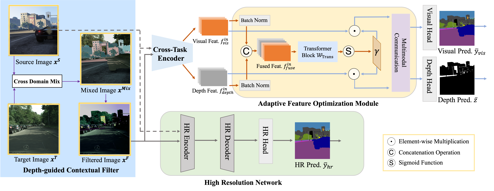

# Transferring to Real-World Layouts: A Depth-aware Framework for Scene Adaptation (ACM MM 2024 Oral)
This is the official implementation of "Transferring to Real-World Layouts: A Depth-aware Framework for Scene Adaptation" (Accepted at ACM MM 2024 as Oral Presentation, Score: 6/5/5).

**by [Mu Chen](https://scholar.google.com/citations?hl=en&user=eyBlZUUAAAAJ), [Zhedong Zheng](https://zdzheng.xyz/), and [Yi Yang](https://scholar.google.com.au/citations?user=RMSuNFwAAAAJ&hl=en), 
</div>

## ArXiv Version of [DCV](https://arxiv.org/abs/2311.12682)

## Overview
Scene segmentation via unsupervised domain adaptation (UDA) enables the transfer of knowledge acquired from source synthetic data to real-world target data, which largely reduces the need for manual pixel-level annotations in the target domain. To facilitate domain-invariant feature learning, existing methods typically mix data from both the source domain and target domain by simply copying and pasting the pixels. Such vanilla methods are usually sub-optimal since they do not take into account how well the mixed layouts correspond to real-world scenarios. Real-world scenarios are with an inherent layout. We observe that semantic categories, such as sidewalks, buildings, and sky, display relatively consistent depth distributions, and could be clearly distinguished in a depth map. Based on such observation, we propose a depth-aware framework to explicitly leverage depth estimation to mix the categories and facilitate the two complementary tasks, i.e., segmentation and depth learning in an end-to-end manner. In particular, the framework contains a Depth-guided Contextual Filter (DCF) forndata augmentation and a cross-task encoder for contextual learning. DCF simulates the real-world layouts, while the cross-task encoder further adaptively fuses the complementing features between two tasks. Besides, it is worth noting that several public datasets do not provide depth annotation. Therefore, we leverage the off-the-shelf depth estimation network to generate the pseudo depth. Extensive experiments show that our proposed methods, even with pseudo depth, achieve competitive performance on two widely-used bench-marks, i.e. 77.7 mIoU on GTA to Cityscapes and 69.3 mIoU on Synthia to Cityscapes.




## Code

Coming soon...

## Citation

If you find this work useful in your research, please star our repository and consider citing:

```
@inproceedings{chen2024transferring,
  title={Transferring to Real-World Layouts: A Depth-aware Framework for Scene Adaptation},
  author={Chen, Mu and Zheng, Zhedong and Yang, Yi },
  booktitle={ACM Multimedia},
  year={2024}
}

@inproceedings{chen2023pipa,
  title={Pipa: Pixel-and patch-wise self-supervised learning for domain adaptative semantic segmentation},
  author={Chen, Mu and Zheng, Zhedong and Yang, Yi and Chua, Tat-Seng},
  booktitle={ACM Multimedia},
  year={2023}
}
```
## Contact

Any comments, please email: mu.chen@student.uts.edu.au.
